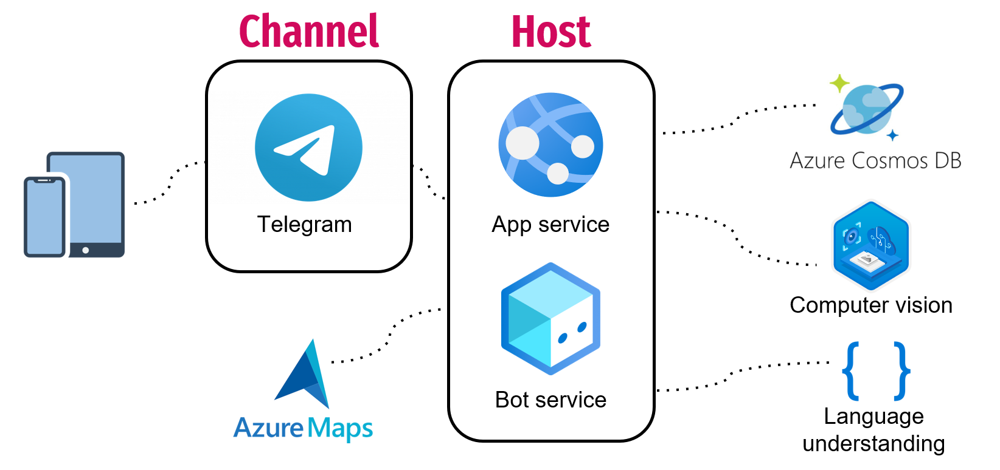

# IttenWearBot
**Autori**: 
- Antonio Zizzari
- Simone Giglio

**IttenWearBot** è un bot intelligente dotato di
sofisticate tecniche di machile learning che aiuta
gli utenti che lo utilizzano a vestirsi bene consigliando
dei vestiti da acquistare secondo alcuni criteri.

Il bot ha molte funzionalità, che sono le seguenti:

-   **Trova corrispondenza**: Trovare un abbinamento basato su un 
    capo d'abbigliamento già in tuo possesso, analizzarne il colore, 
    e trovare l'abbinamento adatto.
-   **Crea outfit**: Nel caso in cui non si voglia specificare un capo
    d'abbigliamento, è possibile creare un outfit da zero scegliendo un 
    colore di base dal quale partire.
-   **Visualizza wishlist**: Mostra i capi d'abbigliamento salvati in 
    precedenza. Permette la visualizzazione e l'eliminazione dei capi all'interno della wishlist
-   **Suggerisci luoghi foto**: Suggerisce all'utente dei luoghi nei quali 
    puoi scattare foto in base al meteo del luogo in cui si trova.
## Architettura
<p align="center"></p>

Il bot è stato sviluppato in Python ed è stato pubblicato sul canale
Telegram ed utilizza i seguenti servizi:

-   **AppService**: Per effettuare hosting dell'applicazione su cloud.
-   **BotService**: Per sviluppare, testare e pubblicare il bot
    in Azure.
-   **Azure Cosmos DB**: Per conservare i dati persistenti relativi agli utenti
    e alle wishlist associate.    
-   **LUIS**: Per riconoscere ed interpretare la psicologia dei colori in crea outfit.
-   **Azure Computer Vision**: Per elaborare le immagini della funzione trova
    corrispondenza ed ottenere sia chi sono gli oggetti nella foto che il colore principale
-   **AzureMaps**: Quando viene suggerito un luogo incui fare le foto il servizio utilizza delle richieste https per ricevere informazioni sul posto inviato dall'utente

Prerequisiti
------------

- [An Azure Subscription](https://portal.azure.com/)
- [Python](https://www.python.org/downloads/release/python-380/)
- [Azure CLI](https://docs.microsoft.com/it-it/cli/azure/install-azure-cli)
- [ngrok](https://ngrok.com/)
- [PyCharm](https://www.jetbrains.com/pycharm/download/#section=windows)

Installazione
-------------

Clonare la repository Github e installare in un ambiente virtuale i
pacchetti richiesti con il comando:
```sh
pip install -r requirements.txt
```

### Cosmos DB
[CosmosDB](https://docs.microsoft.com/en-us/azure/cosmos-db/introduction) è un database NoSQL offerto dai servizi Azure per lo sviluppo di app moderne, offrendo tempi di risposta veloci e scalabilità automatica.
Cosmos DB mantiene json che tengono traccia del numero di mascherine totali indossate dagli utenti giorno per giorno.
Utilizzo del portale di Azure:
1. Creare una nuova risorsa utilizzando la barra di ricerca e cercare 'Azure Cosmos DB'.
2. Specificare "serverless" per la voce "Capacity mode".
3. Settare "Core(SQL)" per la voce "API".
4. Confermare la creazione della risorsa.

### LUIS 

Per configurare LUIS – Language Understanding in modo semplice e veloce
basta accedere al portale dedicato: <https://www.luis.ai/>.

Per istanziare una app LUIS si necessita di eseguire i seguenti
passaggi:

1.  Accedere all’apposito portale, inserendo le credenziali di Azure.
2.  Cliccare sul bottone “**New App**” per creare una nuova istanza.
3.  Compilare la form con il nome dell’app, una breve
    descrizione (facoltativa) e selezionare la lingua target ed il
    gruppo di risorse in cui inserire l’applicazione.
4.  Una volta creata la risorsa, si possono creare gli intent, che sono
    utili ad interpretare il linguaggio comune e definire un’azione
    da intraprendere.
5.  Per creare un intent cliccare sul bottone “New” della scheda Intent
    ed inserire il nome per l’intent corrente.
6.  Una volta creato l’intent è possibile inserire delle frasi di
    esempio per addestrare il modello. Il seguente passo deve essere
    iterato per ogni frase di esempio da considerare.
7.  Dopo aver inserito tutte le frasi di cui si occorre, cliccare il
    bottone in alto a destra “Train” per addestrare il modello.
8.  Dopo aver addestrato il modello, cliccare sul bottone “Publish” e
    scegliere l’opzione “Production Slot”.
9.  Dopo aver eseguito la pubblicazione comparirà una notifica con un
    link che ci riporta all’endpoint url. Dopo aver cliccato sul link è
    possibile prelevare l’endpoint url che verrà utilizzato
    nell’applicazione del bot, l’app Id e le key associate alle risorse.
10. Utilizzare i parametri del passo 9, per configurare la
    propria applicazione. Nel codice del bot inserire i parametri nel
    file *config.py.*
    
### Computer Vision
[Computer Vision](https://docs.microsoft.com/it-it/azure/cognitive-services/computer-vision/overview) può ottimizzare molti scenari di gestione delle risorse digitali. La gestione delle risorse digitali è il processo aziendale per l'organizzazione, l'archiviazione e il recupero di risorse multimediali elaborate e per la gestione dei diritti e delle autorizzazioni digitali.
Utilizzo del portale di Azure:
1. Creare una nuova risorsa utilizzando la barra di ricerca e cercare 'Computer Vision'.
2. Specificare la tariffa preferita (F0 usata nel progetto).
3. Confermare la creazione della risorsa.

### Azure Maps
[Azure Maps](https://docs.microsoft.com/it-it/rest/api/maps/) offre agli sviluppatori di tutti i settori potenti funzionalità geospaziali, combinate con i dati delle mappe più aggiornati. Mappe di Azure è disponibile sia per le applicazioni Web che per quelle per dispositivi mobili. Azure Mappe è un set di API REST conforme all'API Di Azure One.
Utilizzo del portale di Azure:
1. Creare una nuova risorsa utilizzando la barra di ricerca e cercare 'Azure Maps'.
2. Specificare la tariffa preferita (Gen1 S1 usata nel progetto).
3. Confermare la creazione della risorsa.

### Servizio dell’applicazione bot

1.  Nel browser passare al **portale di Azure**.
2.  Nel pannello di sinistra selezionare **Crea una nuova risorsa**.
3.  Nel pannello di destra cercare i tipi di risorsa che includono la
    parola *bot* e scegliere **Registrazione canali bot**.
4.  Fare clic su **Crea**.
5.  Nel pannello **Registrazione canali bot** immettere le informazioni
    richieste. 
6.  Fare clic su **Creazione automatica password e ID app** e
    selezionare **Crea nuovo**.
7.  Fare clic su **Crea ID app nel portale di registrazione
    dell'app**. Verrà aperta una nuova pagina.
8.  Nella pagina **Registrazioni per l'app** fare clic su **Nuova
    registrazione** in alto a sinistra.
9.  Immettere il nome dell'applicazione bot che si intende registrare,
    ad esempio IttenWearBot. Per ogni bot è necessario specificare un
    nome univoco.
10. Per **Tipi di account supportati** selezionare *Account in qualsiasi
    directory dell'organizzazione (qualsiasi directory di Azure AD -
    Multi-tenant) e account Microsoft personali (ad esempio,
    Skype, Xbox)*.
11. Fare clic su **Register**. Al termine, Azure visualizza una pagina
    di panoramica per la registrazione dell'app.
12. Copiare il valore di **ID applicazione (client)** e salvarlo in
    un file.
13. Nel pannello di sinistra fai clic su **Certificati e segreti**.

    1.  In *Segreti client* fare clic su **Nuovo segreto client**.
    2.  Aggiungere una descrizione per identificare questo segreto
        rispetto ad altri che potrebbero essere necessari per creare
        per l'app.
    3.  Impostare **Scadenza** su **Mai**.
    4.  Scegliere **Aggiungi**.
    5.  Copiare il nuovo segreto client e salvarlo in un file

14. Tornare alla finestra *Registrazione canali bot* e copiare il valore
    di **ID app** e **Segreto client** rispettivamente nelle
    caselle **ID app Microsoft** e **Password**.
15. Fare clic su **OK**.
16. Fare infine clic su **Crea**.

## Guida all'esecuzione

Il bot può essere testato in locale utilizzando Bot Framework Emulator e ngrok.

### Local hosting
#### Testare il bot utilizzando Bot Framework Emulator
1. Avviare il venv su PyCharm digistando
```sh
venv\Scripts\activate.bat
python app.py
```
2. Avviare Bot Framework Emulator e selezionare 'Open Bot'.
3. Inserire i campi richiesti:
    * Bot URL: `http://localhost:3978/api/messages`
    * Microsoft App ID: presente nel file config.py
    * Microsoft App password: presente nel file config.py

#### Testare il bot su Telegram
Creare un nuovo bot per Telegram e nella sezione Canali del servizio bot configurare il bot inserendo il token.
1. Avviare ngrok
```sh
$ ./ngrok http -host-header=rewrite 3978
```
2. Recarsi nella sezione Impostazioni del servizio bot ed inserire come endpoint di messaggistica l'indirizzo https generato da ngok.
3. Testare il bot utilizzando Telegram.

### Cloud Hosting
1. Eseguire il deploy della web app utilizzando [](uesta guida](https://docs.microsoft.com/it-it/azure/bot-service/bot-builder-deploy-az-cli?view=azure-bot-service-4.0&tabs=python)
2. Assicurarsi che l'endpoint del servizio bot sia corretto (se è stato modificato). 
3. A questo punto è possibile testare il bot utilizzando Telegram o la web chat su Azure.
